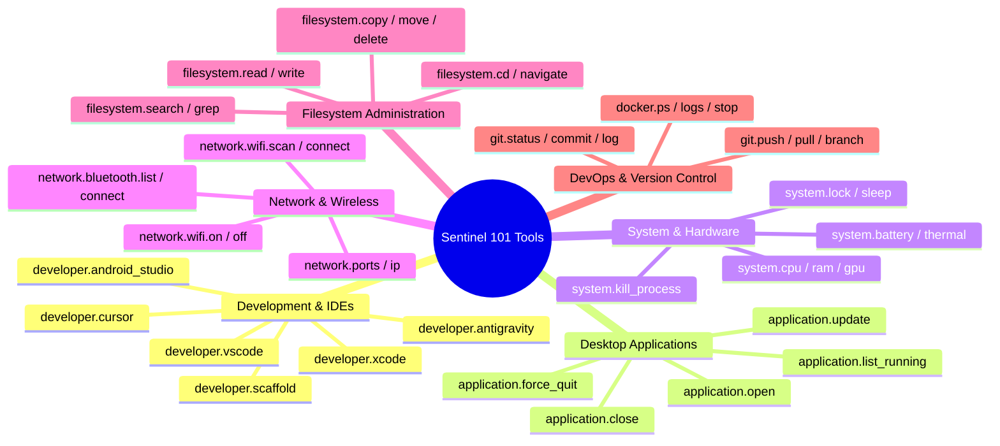

<div align="center">

# ⚡ Sentinel Terminal

**The AI-native terminal engineered for absolute speed, privacy, and desktop orchestration—powered by 100% offline local models.**

<br>

[](https://github.com/NetPranav/Sentinal-Terminal/actions)
[](https://github.com/NetPranav/Sentinal-Terminal/actions)
[](tools/)
[](https://github.com/NetPranav/Sentinal-Terminal)
[](docs/CROSS_PLATFORM_SHARING.md)
[](LICENSE)

<br>

<p align="center">
  <a href="#-features--architectural-highlights"><b>Explore Features</b></a> •
  <a href="#-adaptive-multi-phase-ai-planning-engine"><b>AI Architecture</b></a> •
  <a href="#-complete-command-quick-reference"><b>Command Reference</b></a> •
  <a href="#-download--installation"><b>Download</b></a> •
  <a href="#-cross-platform-synchronization"><b>Cross-Platform Core</b></a> •
  <a href="docs/TODO.md"><b>Engineering Roadmap</b></a>
</p>

</div>

---

## 🌟 Transform Your Command-Line Experience

**Sentinel Terminal** bridges the gap between traditional UNIX shell performance and autonomous agentic workflow execution. Built with **Tauri v2**, **Rust**, and **React 19**, Sentinel delivers instantaneous sub-millisecond PTY shell responsiveness while letting you orchestrate complex multi-step desktop tasks using natural language.

Whether navigating deeply nested repositories, managing Docker containers, launching development IDEs, scanning wireless infrastructure, or inspecting hardware diagnostics, Sentinel operates **completely on-device**:
- 🔒 **Zero Cloud Data Transmission**: All prompts, system telemetry, and command lines stay 100% local.
- ⚡ **Zero API Latency & Rate Limits**: Runs seamlessly offline via Ollama, llama.cpp, or embedded local models.
- 🛡️ **Zero-Trust Guarded Execution**: Proactive policy inspection, destructive command blocking, and rollback safety.

---

## 📸 Visual Workspace Gallery

<div align="center">
  <table>
    <tr>
      <td width="50%"></td>
      <td width="50%"></td>
    </tr>
    <tr>
      <td width="50%"></td>
      <td width="50%"></td>
    </tr>
    <tr>
      <td width="50%"></td>
      <td width="50%"></td>
    </tr>
    <tr>
      <td width="50%"></td>
      <td width="50%"></td>
    </tr>
  </table>
  <p><i>A glassmorphic, acrylic-rendered desktop workspace uniting native PTY sessions with conversational intelligence.</i></p>
</div>

---

## ✨ Features & Architectural Highlights

### 🤖 The `>` Explicit AI Trigger (Zero Friction Muscle Memory)
Sentinel never hijacks standard terminal keystrokes. When you run regular commands (`ls -la`, `git status`, `cargo build`, `npm run dev`), Sentinel executes directly in your high-speed PTY shell with **zero latency**.

Whenever you need autonomous planning, multi-step orchestration, or desktop control, simply prefix your instruction with **`>`**:
```bash
# Standard shell command (instant native PTY execution):
pranav@macbook ~ % ls -lh ~/Downloads

# AI Automation prompt (instant capability resolution):
pranav@macbook ~ % >open this project in vs code and check git status
[Plan Engine] Phase 1: Launch Visual Studio Code at current directory
[Plan Engine] Phase 2: Inspect active Git working tree
✓ Visual Studio Code launched at: .
✓ Git Status: On branch main (clean)
```

---

### 🧠 Adaptive Multi-Phase AI Planning Engine

Sentinel features a sophisticated **hierarchical DAG execution engine** capable of dynamic real-time adaptation:

```
                          ┌───────────────────────────┐
                          │   Natural Language Goal   │
                          └─────────────┬─────────────┘
                                        ▼
                          ┌───────────────────────────┐
                          │    Phase-by-Phase Plan    │
                          │   [1] ➔ [2] ➔ [3] ➔ [4]   │
                          └─────────────┬─────────────┘
                                        │
                 ┌──────────────────────┼──────────────────────┐
                 ▼                      ▼                      ▼
        ┌─────────────────┐    ┌─────────────────┐    ┌─────────────────┐
        │ Early Goal Met? │    │  Step Succeeded │    │ New Requirement?│
        │ ⊘ Skip Phase 3-4│    │  ✓ Advance Next │    │ ⊕ Expand 2.1/2.2│
        └─────────────────┘    └─────────────────┘    └─────────────────┘
```

- **Phase-by-Phase Execution**: Executes phases sequentially with real-time UI status updates (`pending` ➔ `running` ➔ `completed` / `skipped` / `failed`).
- **Dynamic Sub-Phase Expansion**: If Phase 2 encounters unforeseen requirements (e.g. missing dependencies), the engine dynamically spawns **Phase 2.1** and **Phase 2.2** on the fly without breaking the main execution graph.
- **Early Goal Satisfaction**: If the user's objective is fully satisfied ahead of schedule, subsequent phases are intelligently skipped rather than wasting execution time.
- **Interactive Clarification**: Ambiguous requests automatically trigger a concise, inline question with an execution pause until resolved.

---

### 🛡️ Zero-Trust Security Engine & Safe Mode Whitelisting

Sentinel protects your operating system through a multi-tier defense system:
- **Harmless Read-Only Whitelisting**: Harmless commands (`>what time is it`, `>who am i`, `>show env`, `>cal`, `>uptime`) evaluate to **`SAFE` (Score: 5/100)** and execute immediately with zero password friction.
- **Sensitive Operations Consent**: Display/session locking (`system.lock`), Bluetooth toggling, and network scans require user consent before interruptive actions occur.
- **Administrative Quarantine**: Destructive operations (recursive file deletion, killing core system processes, modifying `/System` or `/etc`) trigger mandatory explicit approval modals with password authentication holds.
- **Automatic Execution Timeouts**: All capability invocations are guarded by a 30-second cancellation race, preventing hanging interactive CLI prompts from freezing your terminal session.

---

### 🎯 Universal IDE & Desktop Application Launchers

Sentinel natively bridges conversational grammar to your preferred developer tools:
- **Contextual Resolvers**: Automatically translates conversational phrases like `"this folder"`, `"current project"`, or `"here"` to `.` (the active working directory).
- **Intelligent Article Stripping**: Removes conversational filler (`"the Vs Code"`, `"my chrome"`, `"an android studio"`).
- **Integrated IDE Launchers**:
  - `>open this folder in vs code` ➔ Launches **Visual Studio Code** at `.`
  - `>open this folder inside antigravity` ➔ Launches **Antigravity IDE** at `.`
  - `>open current project in cursor` ➔ Launches **Cursor AI** at `.`
  - `>open in xcode` / `>open in android studio` ➔ Direct native workspace launch.

---

## ⚡ Complete Command Quick-Reference

Try typing these real commands into Sentinel today! Simply start with **`>`**:

| Category | Example Command (`>`) | Tool Invocation | Behavior & Outcome |
| :--- | :--- | :--- | :--- |
| **Development & IDEs** | `>open this folder in vs code` | `developer.vscode` | Resolves target to `.` and launches **Visual Studio Code.app**. |
| | `>open this folder inside antigravity` | `application.open` | Resolves app to **Antigravity IDE** with current working directory. |
| | `>open current project in cursor` | `developer.cursor` | Launches **Cursor.app** with active workspace path. |
| | `>open in xcode` / `>open in android studio` | `developer.xcode` | Opens mobile development IDEs directly in the active project. |
| **System Utilities** | `>what time is it` / `>date` | `shell.execute` (`date`) | Displays current system date and time with **zero password prompt**. |
| | `>who am i` / `>current user` | `shell.execute` (`whoami`) | Instantly displays active operating system user. |
| | `>show environment variables` | `shell.execute` (`env`) | Displays clean shell environment declarations. |
| | `>clear terminal` / `>clean screen` | `shell.execute` (`clear`) | Wipes terminal buffer with zero leftover logs. |
| | `>show me the calendar for this month` | `shell.execute` (`cal`) | Formats a visual monthly calendar table. |
| **Application Control** | `>tell me all the running applications` | `application.list_running` | Displays curated list of active graphical applications. |
| | `>open youtube.com in safari` | `application.open` | Launches Safari and directly navigates to YouTube. |
| | `>stop chrome` / `>kill antigravity` | `system.kill_process` | Cleanly terminates target desktop software processes. |
| | `>update brave browser` | `application.update` | Normalizes app name and updates cask via Homebrew. |
| **Hardware & Network** | `>check battery health and cycle count` | `system.battery` | Queries battery state, charge percentage, and health. |
| | `>scan available wifi networks` | `network.wifi.scan` | Scans visible wireless SSID networks in range. |
| | `>what port is 3000 running on` | `network.ports` | Inspects local TCP socket tables to check if port 3000 is occupied. |
| | `>show all bluetooth devices` | `network.bluetooth.list` | Scans and lists paired and discoverable Bluetooth peripherals. |
| **Filesystem & Git** | `>take me to downloads` | `filesystem.cd` | Synchronizes active shell working directory to `~/Downloads`. |
| | `>find all files named .env` | `filesystem.search` | Fast recursive search for matching files across current hierarchy. |
| | `>show git commit history` | `git.log` | Formats recent repository commit history cleanly in the terminal. |

---

## 🧰 The 101 Canonical Tool Ecosystem

Sentinel features **101 built-in canonical execution capabilities** organized across 10 system domains. Every single tool is backed by comprehensive JSON schema validation, knowledge metadata, natural language examples, and automated regression test batteries:



---

## 🔄 Cross-Platform Synchronization

Sentinel's architecture cleanly isolates OS-agnostic logic (~85%) from platform-specific execution (~15%):

```
                                  ┌──────────────────────────────────────────────────┐
                                  │           SHARED OS-AGNOSTIC CORE (~85%)         │
                                  │  • tools/                 (All 101 tool schemas) │
                                  │  • src/ai/                (Agent loop & Planner) │
                                  │  • src/presentation/      (React UI & Terminal)  │
                                  │  • src/workflows/         (Workflow engines)     │
                                  │  • src/domain/security/   (PolicyEngine & audit) │
                                  └─────────────────────────┬────────────────────────┘
                                                            │
                     ┌──────────────────────────────────────┼──────────────────────────────────────┐
                     ▼                                      ▼                                      ▼
        ┌─────────────────────────┐            ┌─────────────────────────┐            ┌─────────────────────────┐
        │      macOS Branch       │            │     Windows Branch      │            │      Linux Branch       │
        │ • src-tauri/src/pty.rs  │            │ • pty_windows.rs ConPTY │            │ • POSIX PTY spawning    │
        │ • blueutil / pmset      │            │ • WinRT / PowerShell    │            │ • BlueZ / systemd       │
        │ • macOS AppleScript     │            │ • Windows registry      │            │ • Linux package drivers │
        └─────────────────────────┘            └─────────────────────────┘            └─────────────────────────┘
```

### 1-Command Pull for Teammates:
- **🪟 Windows (PowerShell)**:
  ```powershell
  powershell -ExecutionPolicy Bypass -File .\scripts\sync-shared.ps1
  ```
- **🐧 Linux / macOS (Bash)**:
  ```bash
  ./scripts/sync-shared.sh
  ```
- **🤖 GitHub Action PRs**: Every push to `main` automatically generates synchronization Pull Requests into `windows` and `linux` branches.

*Read the full [Cross-Platform Architecture Guide](docs/CROSS_PLATFORM_SHARING.md) for details.*

---

## 📥 Download & Installation

<div align="center">
  <table>
    <thead>
      <tr>
        <th align="center" width="260">🍏 macOS (Apple Silicon & Intel)</th>
        <th align="center" width="260">🐧 Linux (Debian / Arch / RPM)</th>
        <th align="center" width="260">🪟 Windows (10 / 11)</th>
      </tr>
    </thead>
    <tbody>
      <tr>
        <td align="center"><br><b><a href="https://github.com/NetPranav/Sentinal-Terminal/releases">📦 Download Sentinel Terminal.dmg</a></b><br><i>Available Now (v0.1.0-alpha)</i><br><br></td>
        <td align="center"><br><b><a href="https://github.com/NetPranav/Sentinal-Terminal/tree/linux">🐧 Linux Branch Active</a></b><br><i>In Testing</i><br><br></td>
        <td align="center"><br><b><a href="https://github.com/NetPranav/Sentinal-Terminal/tree/windows">🪟 Windows Branch Active</a></b><br><i>In Testing</i><br><br></td>
      </tr>
    </tbody>
  </table>
</div>

---

## 🧪 Automated Testing & Reliability

Sentinel is hardened with **682 automated unit, integration, and security tests** across **121 test files**, verified on every commit:

```bash
# Run the complete test suite
npm test

# Run capability SDK drivers suite
npx vitest run src/sdk/__tests__/CapabilitySDK.test.ts

# Run security engine tests
npx vitest run src/domain/security/Security.test.ts
```

---

## 📚 Documentation Portal

Everything you need to master Sentinel or contribute code is documented in detail:

### 📖 User Manuals
- **[User Guide](docs/USER_GUIDE.md)**: Mixing traditional shell commands with explicit `>` conversational prompts.
- **[Features Overview](docs/FEATURES.md)**: Offline privacy guarantees, glassmorphic styling, and tool architecture.
- **[Keyboard Shortcuts](docs/KEYBOARD_SHORTCUTS.md)**: Tab navigation, split panes, and window controls.
- **[FAQ](docs/FAQ.md)**: Offline local AI inference, Apple Silicon acceleration, and privacy details.
- **[Security Safeguards](docs/SECURITY.md)**: Zero-Trust policies and safe-mode whitelisting rules.

### 🛠️ Developer & Architecture Guides
- **[Engineering Roadmap & Issues](docs/TODO.md)**: Live tracking of resolved fixes and prioritized open issues.
- **[Cross-Platform Sharing Guide](docs/CROSS_PLATFORM_SHARING.md)**: Synchronization workflows across macOS, Windows, and Linux.
- **[Development Setup](developer/DEVELOPMENT_SETUP.md)**: Setting up Node.js, Rust/Cargo, Tauri v2, and Ollama.
- **[System Architecture](developer/ARCHITECTURE.md)**: Comprehensive breakdown of React views, Rust PTY, and SDK drivers.
- **[Contributing Guide](developer/CONTRIBUTING.md)**: Pull request protocols and testing requirements.

---

## 🗺️ Engineering Roadmap & GitHub Issues

We track all core issues and feature enhancements directly in our prioritized roadmap:
- 🚨 **[GitHub Issue #2](https://github.com/NetPranav/Sentinal-Terminal/issues/2)**: `[P0 - Critical] Compound shell command chaining (&&, ;, ||) bypasses ShellCommandGuard`
- 🚨 **[GitHub Issue #3](https://github.com/NetPranav/Sentinal-Terminal/issues/3)**: `[P0 - Critical] PolicyEngine.protect-system-dirs fails to block deletion of child paths`
- ⚡ **[GitHub Issue #4](https://github.com/NetPranav/Sentinal-Terminal/issues/4)**: `[P1 - High] GitCapability & ShellSDKCapability working directory context (cwd)`
- 🔧 **[GitHub Issue #5](https://github.com/NetPranav/Sentinal-Terminal/issues/5)**: `[P2 - Medium] FilesystemSDKCapability tilde path expansion optimization`
- 💡 **[GitHub Issue #6](https://github.com/NetPranav/Sentinal-Terminal/issues/6)**: `[P3 - Low] Bluetooth peripheral category noun sanitization`

*See the full [Engineering Roadmap](docs/TODO.md) for complete status and historical archives.*

---

## 📜 License

Sentinel Terminal is open-source software released under the **[MIT License](LICENSE)**.

<div align="center">
  <br>
  <b>Built with visual excellence and engineering passion. If Sentinel elevates your workflow, consider starring ⭐️ our repository!</b>
</div>
