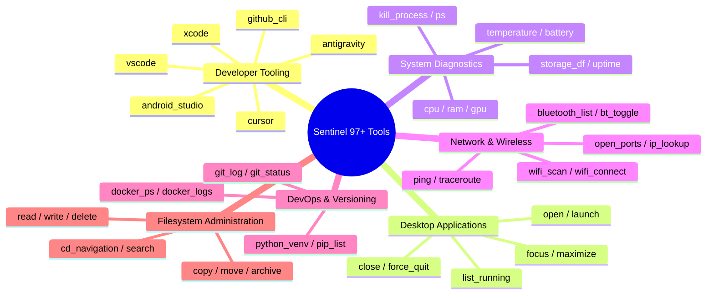

<div align="center">

# ⚡ Sentinel Terminal

**An AI-native terminal that combines natural language, traditional shell workflows, and intelligent automation—powered by 100% offline local models.**

<br>


<br>
<br>

<!-- ========================================================================================= -->
<!-- 🎬 DEMONSTRATION VIDEO PLACEHOLDER: HERO OVERVIEW DEMO                                   -->
<!-- Replace the placeholder below with your 60-second Loom/GIF/Video showing Sentinel in action -->
<!-- Example:                -->
<!-- ========================================================================================= -->

<p align="center">
  <b>[ 🎥 Insert Application Hero Demonstration Video / GIF Here: e.g. <code>./docs/images/sentinel-demo-hero.gif</code> ]</b>
</p>
<p align="center">
  <i>Watch Sentinel seamlessly switch between sub-millisecond zsh shell execution and natural language desktop automation.</i>
</p>

</div>

---

## 🌟 Transform Your Computing Experience

Sentinel redefines the modern command-line interface. Built for developers, software engineers, and power users, Sentinel bridges the gap between traditional shell precision and conversational automation. Whether you are navigating complex project directories, inspecting Docker container log streams, controlling GUI applications and web browsers, launching modern AI IDEs, or performing deep system diagnostics, Sentinel provides an intelligent workspace that executes **completely offline** without cloud data exposure or API latency.

---

<!-- ========================================================================================= -->
<!-- 📸 SCREENSHOT SHOWCASE: MULTI-PANE GLASSMORPHISM WORKSPACE                              -->
<!-- Insert high-res screenshot of split screens, status hierarchy, and glass theme here      -->
<!-- ========================================================================================= -->

<div align="center">
  <br>
  <b>[ 📸 Insert Screenshot of Multi-Pane Split Screen Workspace Here: e.g. <code>./docs/images/split-screen-workspace.png</code> ]</b>
  <p><i>Effortlessly divide your workflow into vertical and horizontal split screens—each maintaining independent directory memory and execution session context.</i></p>
  <br>
</div>

---

## ✨ Architectural Highlights & Capabilities

Sentinel is engineered from the ground up to empower everyday developer workflows with zero friction and visual excellence.

### 🤖 The Explicit `>` AI Trigger (Zero-Friction Intelligence)
Sentinel never gets in the way of your standard muscle memory. When you type traditional command syntax (`ls -la`, `git status`, `npm run dev`, `cargo build`), Sentinel executes directly in your high-speed PTY session with zero overhead.
When you want to summon conversational intelligence or perform automated multi-step desktop orchestration, simply prefix your prompt with the **`>`** symbol:
```bash
# Standard shell command (Runs instantly via native PTY):
pranav@Pranavs-MacBook ~ % ls -l /Applications

# AI Automation command (Triggered by ">" prefix):
pranav@Pranavs-MacBook ~ % >open this folder inside antigravity
[AI Planner] Created workflow: Open Desktop Application
[Command Output] Successfully launched application: Antigravity IDE
```

### 🎯 Universal IDE & Workspace Launchers
Sentinel natively connects with your favorite coding tools and development environments. Using intelligent natural language grammar resolution and native macOS Launch Services (`open -a`), Sentinel resolves conversational phrases and prepositions effortlessly:
- **Natural Phrase Resolution**: Speak naturally—phrases like `"this folder"`, `"this directory"`, `"current project"`, or `"here"` are instantly translated to your current working directory (`.`).
- **Resilient Application Resolution**: Sentinel automatically strips leading articles (`"the Vs Code"`, `"my chrome"`, `"an xcode"`) and maps conversational aliases to exact system bundle names:
  - `>open this folder in the Vs Code` ➔ Launches **Visual Studio Code** at `.`
  - `>Open this folder inside antigravity` ➔ Launches **Antigravity IDE** at `.`
  - `>open current project in cursor` ➔ Launches **Cursor AI** at `.`
  - `>open in android studio` ➔ Launches **Android Studio** at `.`
  - `>open in xcode` ➔ Launches **Apple Xcode** at `.`

### 🛡️ Smart Security & Zero-Friction Safe Mode
Sentinel incorporates a powerful **Zero-Trust Security & Risk Engine** that guards your system against destructive commands while ensuring seamless everyday developer flow:
- **Trivial Utility Whitelisting**: Harmless read-only operational inquiries (`>what time is it`, `>who am i`, `>show environment variables`, `>check uptime`, `>show calendar`) are automatically assessed as **`SAFE` (Score: 5/100)** and execute immediately without triggering disruptive authentication modals or password holds!
- **Gated Destructive Operations**: High-risk actions (e.g., recursive file deletion, formatting disk volumes, or killing mission-critical OS daemons) immediately trigger an interactive visual security hold requiring mandatory explicit user consent and authentication before proceeding.
- **Rollback Capability**: Automated filesystem operations generate matching rollback payloads whenever possible, allowing you to easily revert changes.

### 🧹 Clean Screen Reset Architecture
When you command Sentinel to clear your workspace (`>clear terminal`, `>clear screen`, or `>clean terminal`), Sentinel invokes a direct xterm buffer wipe (`\x1b[2J\x1b[H`) and completely suppresses end-of-workflow summary logs—leaving you with an immaculate, spotless command prompt instantly!

### 💎 Acrylic Glassmorphism & Visual Personalization
- **Translucent Backdrop Styling**: Built with premium glassmorphic visual treatments that reveal underlying macOS wallpapers and desktop aesthetics.
- **Curated Color Palettes**: Switch effortlessly between **Classic Dark**, **Minimalist White**, and vibrant **Cyberpunk Neon** themes.
- **Live Menu Bar Controls**: Adjust backdrop transparency sliders and blur depth in real time from your macOS menu bar under **`Personalization ➔ Appearance & Color Themes...`**.

---

## ⚡ Complete Command Quick-Reference

Try typing these real example commands into Sentinel today! Simply start your instruction with **`>`** to experience instantaneous conversational orchestration:

| Domain Area | Conversational Example (`>`) | Canonical AI Tool Executed | Result & Behavior |
| :--- | :--- | :--- | :--- |
| **Development & IDEs** | `>open this folder in the Vs Code` | `developer.vscode` | Resolves target to `.` and launches **Visual Studio Code.app**. |
| | `>Open this folder inside antigravity` | `application.open` | Resolves app to **Antigravity IDE.app** and opens current directory. |
| | `>open current directory in cursor` | `developer.cursor` | Launches **Cursor.app** with your active project path. |
| | `>open in xcode` / `>open android studio` | `developer.xcode` / `android_studio`| Launches mobile development IDEs directly in your project. |
| **System Utilities** | `>what time is it` / `>show time` | `shell.execute` (`date`) | Displays current time and date instantaneously with **zero password prompt**. |
| | `>who am i` / `>current user` | `shell.execute` (`whoami`) | Instantly displays your active macOS username. |
| | `>show environment variables` / `>env` | `shell.execute` (`env`) | Displays current shell environment variable declarations cleanly. |
| | `>clear terminal` / `>clear screen` | `shell.execute` (`clear`) | Wipes terminal buffer completely clean with zero leftover log clutter. |
| | `>show me the calendar for this month` | `shell.execute` (`cal`) | Formats and displays a clean visual monthly calendar table. |
| **Desktop Application Control**| `>tell me all the running applications` | `application.list_running` | Displays curated list of active graphical apps (*Sentinel*, *Antigravity*, *Chrome*, *Safari*). |
| | `>open youtube.com in safari` | `application.open` | Launches Safari and directly opens the YouTube web platform. |
| | `>stop chrome` / `>kill antigravity` | `system.kill_process` / `force_quit` | Performs a deep, clean termination of target desktop software threads. |
| **Navigation & Filesystem** | `>take me to downloads folder` | `filesystem.cd` / `shell.cd` | Synchronizes shell working directory directly to `~/Downloads`! |
| | `>take me home` | `filesystem.cd` (`~`) | Instantly jumps to your macOS home profile directory. |
| | `>find me all files named .env` | `filesystem.search` | Scans current hierarchy for environment configs via ripgrep/find mechanics. |
| **Hardware & Network** | `>check gpu status and vram` | `system.gpu` | Queries Apple Silicon Metal or discrete graphics utilization and memory. |
| | `>scan available wifi networks` | `network.wifi.scan` | Scans visible wireless SSID infrastructure in your physical vicinity. |
| | `>what port is 3000 running on` | `network.ports` | Inspects local TCP socket tables to check if port 3000 is active or free. |
| | `>show all bluetooth devices` | `network.bluetooth.list` | Scans and lists paired and discoverable Bluetooth hardware peripherals. |
| **Containers & DevOps** | `>list docker containers` | `docker.ps` | Real-time table display of active Docker container IDs, ports, and image tags. |
| | `>show git commit history` | `git.log` | Formats recent repository commit signatures cleanly in your viewport. |

---

## 🧰 The 97+ Tool Knowledge Base Ecosystem

Sentinel incorporates a comprehensive **Operating Knowledge Base** packed directly into the application runtime. Featuring over **97 built-in canonical execution capabilities**, Sentinel translates conversational commands across 10 distinct system domains:



---

## 📥 Download & Install

Experience the speed, privacy, and intelligence of Sentinel Terminal on your machine today:

<div align="center">
  <br>
  <table>
    <thead>
      <tr>
        <th align="center" width="230">🍏 macOS (M1/M2/M3/Intel)</th>
        <th align="center" width="230">🐧 Linux (Debian / Arch / RPM)</th>
        <th align="center" width="230">🪟 Windows (10 / 11)</th>
      </tr>
    </thead>
    <tbody>
      <tr>
        <td align="center"><br><b><a href="https://github.com/NetPranav/Sentinal-Terminal/releases">📦 Download Sentinel Terminal.app</a></b><br><i>Available Now (v0.1.0)</i><br><br></td>
        <td align="center"><br><b>🚧 Coming Soon</b><br><i>In Active Testing</i><br><br></td>
        <td align="center"><br><b>🚧 Coming Soon</b><br><i>Under Development</i><br><br></td>
      </tr>
    </tbody>
  </table>
  <br>
</div>

---

## 🚀 Quick Start & Workspace Tips

Getting started with Sentinel requires zero complex configuration or external cloud API tokens:

1. **Launch the Application**: Drag **`Sentinel Terminal.app`** into your `/Applications/` folder and double-click to launch your multi-pane desktop workspace.
2. **Execute via Muscle Memory or Summon AI (`>`)**: 
   - Run commands like `git status` or `ls -lh` normally for direct, zero-latency execution.
   - When you want AI automation or folder manipulation, prefix your input with **`>`** (e.g., `>open this folder in the Vs Code`).
3. **Multi-Pane Workspace Organization**: Use your macOS desktop top screen menu bar under **`Personalization`** to:
   - Split panes vertically (**`Cmd+D`**) or horizontally (**`Cmd+Shift+D`**).
   - Open new tabs (**`Cmd+T`**) and switch themes instantly!

---

## 📚 Comprehensive Documentation Libraries

Everything you need to master Sentinel as a user or contribute as an open-source software engineer is thoroughly articulated in our documentation portals:

### 📖 For End Users
- **[User Guide](file:///docs/USER_GUIDE.md)**: Master the mixing of traditional shell syntax with explicit `>` conversational commands.
- **[Features Overview](file:///docs/FEATURES.md)**: Deep dive into offline privacy guarantees, glassmorphic styling, and intelligent capability tools.
- **[Keyboard Shortcuts & Menu Controls](file:///docs/KEYBOARD_SHORTCUTS.md)**: Complete hotkey reference table for tab navigation, split views, and menu controls.
- **[Frequently Asked Questions (FAQ)](file:///docs/FAQ.md)**: Explanations regarding offline local AI inference, Apple Silicon Metal acceleration, and data privacy.
- **[Troubleshooting Guide](file:///docs/TROUBLESHOOTING.md)**: Simple fixes for verifying local Ollama connectivity and optimizing macOS accessibility permissions.
- **[Theme & Personalization Manual](file:///docs/THEMES.md)**: Instructions for tailoring backdrop transparency sliders, blur depth, and color palettes.
- **[Security & Risk Safeguards](file:///docs/SECURITY.md)**: Understand how Sentinel's Zero-Trust firewall assesses command danger profiles and whitelists safe commands.

### 🛠️ For Open-Source Contributors & Maintainers
- **[Contributing Manual](file:///developer/CONTRIBUTING.md)**: Welcome guidelines detailing branching workflows, verification mandates, and feature proposal protocols.
- **[Development Setup & Toolchains](file:///developer/DEVELOPMENT_SETUP.md)**: Instructions for preparing Node.js, Rust/Cargo toolchains, Tauri v2 dependencies, and local Ollama installations.
- **[Build & Packaging Reference](file:///developer/BUILD.md)**: Authoritative instructions for compiling standalone macOS `.app` bundles (`npm run build:app`) from source code.
- **[System Architecture Reference](file:///developer/ARCHITECTURE.md)**: Comprehensive architectural breakdown connecting React 19 views with native Rust PTY execution engines.
- **[Tool Registry Knowledge Base Pattern](file:///developer/TOOL_REGISTRY.md)**: How Sentinel organizes its 97+ structured JSON operational schemas, Zod validation models, and semantic indexes.
- **[Capability SDK Driver Engineering](file:///developer/CAPABILITY_SDK.md)**: Code blueprints for subclassing `BaseCapabilityDriver` to invoke native operating system APIs and Launch Services.
- **[Intent Engine & LoRA Telemetry Pipelines](file:///developer/INTENT_AI.md)**: Technical specifications for conversational trimming algorithms and offline JSONL training dataset generation.
- **[Automated Verification Testing](file:///developer/TESTING.md)**: Guide to executing our automated Vitest test verification battery (82+ unit tests) and writing capability assertions.

---

## 🗺️ Product Roadmap

Sentinel continuously evolves to bring state-of-the-art desktop developer ergonomics to life. Highlights from our upcoming engineering timeline include:
- **🌐 SSH Host Intelligence & Remote Autonomy**: Apply conversational directory navigation and smart system log exploration across active remote SSH server connections without installing remote dependencies.
- **🧩 Visual Workflow Designer**: Construct automated multi-step development pipelines using an interactive drag-and-drop workspace canvas directly inside your terminal window.
- **🖼️ Multi-Modal Image Interpretation**: Simply paste UI error screenshots or architectural diagrams straight into terminal panes for immediate offline AI diagnostics and command suggestions.

*Review our comprehensive **[Product Roadmap Documentation](file:///docs/ROADMAP.md)** for complete engineering timelines and future milestones!*

---

## 📜 License

Sentinel Terminal is open-source software released under the **MIT License**. See the `LICENSE` file for distribution terms.

---

<p align="center">
  <b>Built with visual excellence and engineering passion. If Sentinel elevates your everyday command workflow, consider giving us a ⭐️ on GitHub!</b>
</p>
