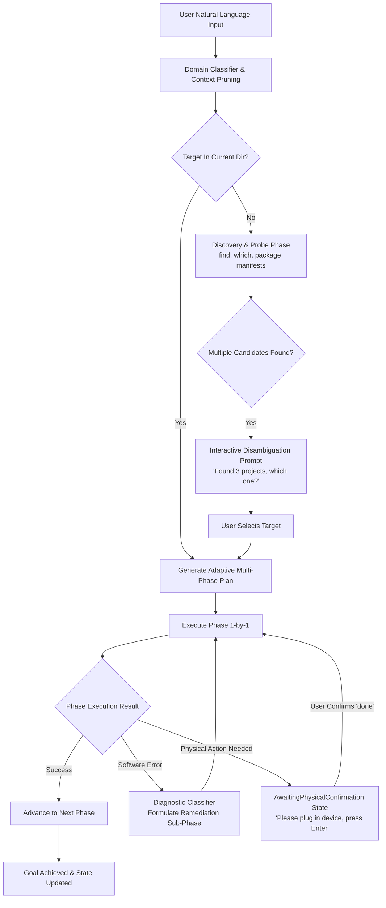

# Sentinel Terminal — Next-Gen Intelligent Planning & Autonomous Execution Architecture

## 🎯 Executive Overview & Vision

Sentinel Terminal is designed to eliminate the exhausting cycle of copying terminal errors into external web AIs, pasting commands back, encountering new errors, and getting stuck in system deadlocks. 

This architecture specification outlines the evolution of Sentinel's planning and execution engine from a basic single-shot tool caller into an **autonomous, self-healing, context-discovering terminal operating system**.

---

## 🏛️ The Three Motivating Real-World Scenarios

### 1. 🪟 Windows / Stuck-State Triage & Autonomous Error Recovery
- **The Problem**: A background service crashes, a port is held by an orphaned process, or a build command throws cryptic stderr output. The developer is trapped in a copy-paste feedback loop between the terminal and web AI.
- **The Sentinel Solution**:
  - Intercepts non-zero exit codes and `stderr` streams directly within the agent loop.
  - Classifies errors into **Software Recoverable** vs. **Physical Action Required**.
  - If software recoverable (e.g. port 3000 in use, lockfile present, missing directory): automatically injects a corrective sub-phase (e.g. `Phase 2.1: Free port 3000`) and retries the failed operation.
  - If physical action is required (e.g. device disconnected, hardware Wi-Fi switch off, insert USB key): enters an **`AwaitingPhysicalConfirmation`** state, explains exactly what hardware action is needed, pauses, and resumes when the user confirms with Enter or "done".

### 2. 🐧 Linux / Ubuntu Robotics (ROS / Multi-Project Discovery & Disambiguation)
- **The Problem**: A robotics engineer has multiple workspaces (`~/catkin_ws`, `~/drone_ws`, `~/rover_ws`) with various launch files and simulation packages (Gazebo, RViz). Remembering exact paths, package names, and environment sourcing scripts is cumbersome.
- **The Sentinel Solution**:
  - **Probe-Before-Execution**: If a requested target (e.g. `>run gazebo`) is not in the active directory, the engine initiates a Discovery Probe across user directories, scanning for package manifests (`package.xml`, `launch.py`, `docker-compose.yml`, `Cargo.toml`).
  - **Interactive Disambiguation**: If multiple matches are found, it immediately halts and presents a clean selection menu:
    ```
    I found Gazebo configured in 3 workspaces:
      [1] ~/drone_ws/src/quad_sim (ROS 2 Humble)
      [2] ~/rover_ws/src/rover_gazebo (ROS 1 Noetic)
      [3] ~/robotics_ws/src/navigation
    Which project would you like to run? [1-3]:
    ```
  - **Autonomous Contextual Execution**: Automatically `cd`s to the chosen workspace, executes `source install/setup.bash` (or equivalent), and launches the node.

### 3. ⚙️ Arch Linux / Power-User "Rice" & Service Orchestration
- **The Problem**: Configuring startup items, tweaking window manager configs (`hyprland`, `i3`, `waybar`), or toggling systemd user services involves searching through scattered dotfiles in `~/.config/`, remembering exact service unit names, and verifying syntax.
- **The Sentinel Solution**:
  - Natural language commands like `>disable redshift on startup` or `>turn off bluetooth daemon on boot`.
  - Native service driver abstractions (`systemctl --user`, `launchctl`, Windows Service Control).
  - Safe dotfile config patcher (`config.patch`) that creates an automatic `.bak` snapshot, updates the target setting, and tests/reloads the service with rollback guarantees if syntax fails.

---

## 🧩 Architectural Phases of the New Autonomous Engine



---

## 📦 Phase-by-Phase Implementation Roadmap

### 🔷 Phase 1: Autonomous Error Triage & "Awaiting Physical Confirmation" Engine
1. **`src/ai/agent/ErrorDiagnosticsEngine.ts`**:
   - Pattern matchers and classifiers for standard OS and CLI failure signatures (`EADDRINUSE`, `ENOENT`, `EACCES`, `command not found`, `device offline`, `permission denied`, `lockfile held`).
   - Categorizes failures into `SOFTWARE_RECOVERABLE` vs `PHYSICAL_ACTION_REQUIRED`.
2. **`AdaptivePlanEngine` Self-Healing Sub-Phases**:
   - Automatically generates dynamic remediation steps (e.g. `Phase 2.1: Terminate process occupying port 3000`).
   - Automatically re-attempts the original phase up to 3 times before graceful degradation.
3. **`HumanInTheLoopState`**:
   - Adds an `AWAITING_PHYSICAL_ACTION` lifecycle status.
   - Emits an interactive prompt: *"Please connect your hardware device and type 'done' or press Enter."*
   - Listens on the input stream and seamlessly resumes execution.

### 🔷 Phase 2: Probe & Disambiguate Discovery Engine
1. **`src/domain/discovery/ProjectDiscoveryEngine.ts`**:
   - Deep filesystem scanner targeting development workspaces:
     - ROS 1 / ROS 2 (`package.xml`, `*.launch`, `*.launch.py`)
     - Node / Web (`package.json`, `pnpm-workspace.yaml`)
     - Python / AI (`pyproject.toml`, `requirements.txt`, `environment.yml`)
     - Rust / Go / C++ (`Cargo.toml`, `go.mod`, `CMakeLists.txt`)
     - Docker (`docker-compose.yml`, `Dockerfile`)
2. **Interactive Selection Menus in TerminalView**:
   - Renders numbered selection pills when multiple candidate projects match.
   - Resolves ambiguous goals (*"run my gazebo"*) without blind guessing.
3. **Workspace Environment Sourcing**:
   - Captures and executes prerequisite shell environment setups (`source .../setup.bash`, `conda activate`, `source .venv/bin/activate`) before running project binaries.

### 🔷 Phase 3: System Services & Dotfile "Rice" Management
1. **`system.service` Unified Capability Driver**:
   - **Linux**: `systemctl [--user] {enable,disable,start,stop,restart,status} <service>`
   - **macOS**: `launchctl {bootstrap,bootout,enable,disable,print} <service>`
   - **Windows**: `Get-Service`, `Start-Service`, `Stop-Service`, `sc.exe config`
2. **`config.patch` Safe Dotfile Mutation Engine**:
   - Discovers config files in `~/.config/` or platform directories.
   - Performs atomic writes with `.sentinel.bak` rollback snapshots.
   - Validates config syntax before restarting or reloading the relevant daemon.

### 🔷 Phase 4: Small-Model Cognitive Supercharger
1. **Two-Tier Intent Classification**:
   - **Tier 1 (Intent & Domain Routing)**: Determines if the request is `DevOps/ROS`, `System/Service`, `Filesystem`, `Network`, or `Desktop/App`.
   - **Tier 2 (Domain-Specific Context Injection)**: Injects **only the 4 to 6 tools** relevant to that specific domain into the prompt, preventing context saturation on 1.5B/3B/7B models.
2. **Guided JSON Grammar Constraints**:
   - Enforces strict deterministic JSON outputs for local Ollama / llama.cpp models.
